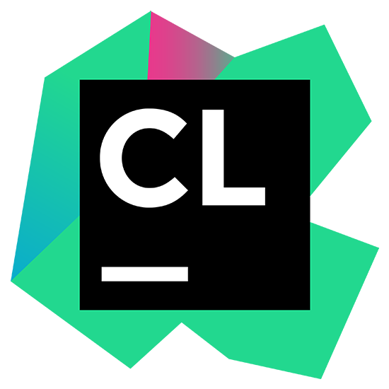
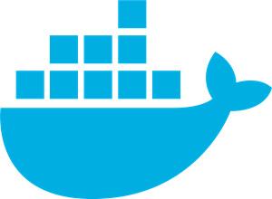

## Table of Contents
- [Welcome](#soanguimpali-clovis-jerome)
- [About Me](#about-me)
- [Skills](#skills)
- [Programming Languages](#programming-languages)
- [Backend-frameworks](#backend-frameworks)
- [Frontend-frameworks](#frontend-frameworks)
- [Databases and ORM](#databases)
- [IDE and Editors](#ide-and-editors)
- [Tools](#tools)
- [Operating Systems](#operating-systems)
- [Stats](#my-github-stats)
- [Top languages](#top-languages)
- [Visitors](#visitors)
- [Views](#views)
- [Streak Stats](#streak-stats)
- [Trophies](#trophies)
- [Activity Graph](#activity-graph)
- [Followers](#followers)

## Hello World! I'm Soanguimpali Clovis Jerôme

## About Me
- 🔭 I’m currently working as a Full-Stack Software Engineer at [DECLIC](https://declic.africa/) 
- 🌱 I’m currently following the ALX Full-Stack Software Engineering Program at [ALX](https://www.alxafrica.com/software-engineering-2022/)
- 👯 I’m looking to collaborate on any open source project that can help me improve my skills
- 🤔 I’m looking for help with finding a job as a Full-Stack Software Engineer or a Full-Stack Web Developer in remote
- 💬 Ask me about anything
- 📫 How to reach me: [LinkedIn](https://www.linkedin.com/in/faso-dev/)
- 😄 Pronouns: He/Him
- ⚡ Fun fact: I love to create humorous memes with code
- 📝 [Resume](mailto:jeromeonadja28@gmail.com)

## Skills
- Building RESTful APIs with Node.js, Flask, Laravel, Symfony [x]
- Building Single Page Applications with React [x]
- Building Progressive Web Applications with React [x]
- Working with databases like MySQL, PostgreSQL [x]
- Writing unit and integration tests with Jest, PHPUnit, Panther, Cypress [x]
- Working with Git and GitHub [x]
- Working with Docker and Docker Compose [x]
- Working with Linux and shell scripting [x]
- Working with HeroKu [x]
- Working with Twilio [x]
- Integrating third-party APIs [x]
- Integrating mockups with HTML, CSS, SAAS, Bootstrap, JavaScript, Typescript [x]
- Code refactoring and optimization [x]
- Writing clean and maintainable code [x]
- Writing clean and maintainable documentation [x]
- more...

## Programming Languages
-  PHP : +5 years
-  JavaScript : +4 years
-  TypeScript : +4 years
-  Python : +3 years
-  C : +2 years

## Back-End frameworks
-  Symfony : +4 years
-  Laravel : +3 years
-  Flask : +2 years
-  AdonisJS : +1 year

## Front-End frameworks
-  Bootstrap : +4 years
-  React : +3 years
-  Redux : +2 years
-  React Material UI : +2 years

## Databases and ORM
-  MySQL/MariaDB : +4 years
-  PostgreSQL : +3 years
-  Doctrine : +3 years
-  SQLAlchemy : +2 years

## IDEs and Editors
-  PhpStorm : +4 years
-  PyCharm : +3 years
-  IntelliJ : +2 years
-  CLion : +1 years

## Tools
-  Git : +4 years
-  GitHub : +4 years
-  Heroku : +4 years
-  Docker : +2 years
-  Bash/Shell : +4 years

## Operating Systems
-  Linux : +4 years

## Stats

## Top languages

## Visitors

## Views

## Streak Stats

## Trophies
[]

## Activity Graph

## Followers

